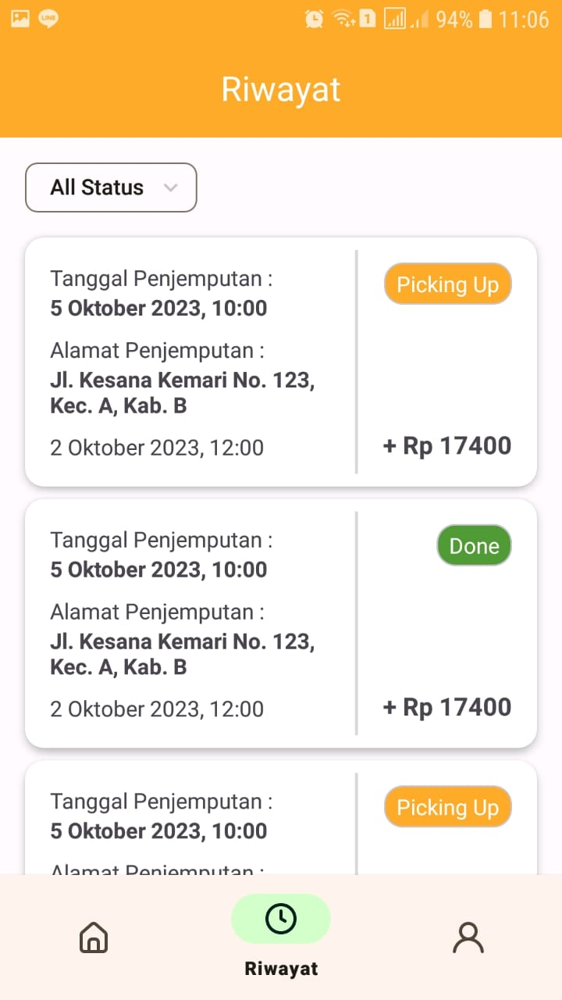

# CP-ME-2 Bengkel Sampah Mobile App

**Capstone Project Industry partner with BengkelSampah**

Project **Bengkel Sampah Mobile app** yang kami kerjakan ini merupakan project kolaborasi antara GIGIH 3.0. dan industri partner Bengkel Sampah. Aplikasi ini memiliki tujuan sebagai protal bagi pengguna layanan BengkelSampah seperti Jual Beli Sampah, Bank Sampah, dan lain lain. Kami harap denngan adanya aplikasi ini bisa mempermudah pengguna layanan BengkelSampah dalam melakukan transaksi, memonitor pengelolaan transaksi, dan tentunya "Mengubah Sampah Jadi Cuan".

## Features 🚀

Beberapa fitur yang ada di dalam aplikasi Bengkel Sampah adalah:
- **Jual Sampah** - Melakukan transaksi jual beli sampah
- **Jemput Sampah** - Menampilkan sampah-sampah yang akan dijemput oleh driver
- **News** - Menampilkan list artikel
- **MoneyBag** - Menampilkan poin yang dimiliki pengguna yang nantinya dapat digunakan untuk penukaran voucher
- **BankSampah** - Menampilkan hasil tabungan sampah di mitra BengkelSampah
- **History** - Menampilkan riwayat transaksi dan pengunduhan file transaksi yang telah selesai
- **Localization** - Mendukung 2 bahasa yaitu Bahasa Indonesia dan Bahasa Inggris

**Note**: Dikarenakan keterbatasan waktu dan sumber daya, sebagian besar data masih di simpan menggunakan local database

## Tech-Stack 🖼

Project ini dibangun menggunakan beberapa tools & teknologi seperti yang ada di bawah ini:
- Room Database
- XML UI
- Retrofit & OkHttp
- Shimmer
- Reactive Programming: Kotlin Coroutine Flow
- Glide
- Dagger Hilt
- Clean Architect Layer Separation (Domain,Data,Presentation)

## Code Architecture 
Project BengkelSampah menggunakan **MVVM (Model-View-View Model) sebagai architecture pattern dan **Repository pattern** untuk mengatur resource aplikasi baik dari local maupun remote. Dependency injection diimplementasi menggunakan **Dagger Hilt**

## Installation 

### Prerequisites

Pastikan perangkat Android anda memiliki API level 24 atau di atasnya.

### Clone Project

Kamu dapat melakukan clone terhadap project ini dengan menggunakan perintah berikut.

```
git clone "https://github.com/ddenfi/CP-ME-2-BengkelSampah.git"
```

## Dependencies

| Library | Version |
|---|---|
| androidx core | 1.12.0 |
| androidx appcompat | 1.6.1 |
| google material | 1.10.0 |
| androidx constraintlayout | 2.1.4 |
| androidx navigation | 2.6.0 |
| kotlinx coroutines | 1.6.4 |
| androidx lifecycle | 2.6.2 |
| androidx room | 2.5.2 |
| dagger hilt | 2.47 |
| glide | 4.16.0 |
| retrofit2 | 2.9.0 |
| okhttp3 | 4.10.0 |
| facebook shimmer | 0.5.0 |
| sweetalert | 1.6.2 |
| itextpdf | 7.1.13 |
| androidx datastore | 1.0.0 |
| androidx viewpager2 | 1.0.0 |
| dotsindicator | 5.0 |
| androidx splashscreen | 1.0.0 |
| gson | 2.10.1 |

## Endpoints
- `/auth/register` - mendaftar akun baru
- `/auth/login` - masuk ke akun yang sudah pernah didaftarkan

**Note**: Belum semua endpoints terimplemetasi dikarenakan masih dalam tahap pengembangan.

## Screenshot App

   

   

  

  


